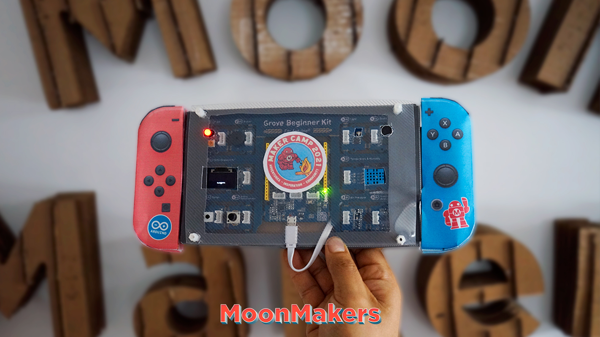

# Science-Game - Programming Grove Beginner Kit for Arduino

* [English](#English)
* [Español](#Español)

## Español

Crea y construye un juego interactivo con los sensores de Grove Beginner Kit, donde aprenderás a programar cada uno de los sensores al igual que tu pantalla, buzzer y led. Para después divertirte y conocer distintos usos e ideas para tu próximo proyecto.

### materiales
* Grove Beginner Kit for Arduino.
* Un cable micro usb.
* Una computadora, con acceso a internet
* Arduino IDE
* Plantillas de la consola
* Tijeras
* Barra de pegamento
* Acetato

### Aprenderas

Aprende a programar cada uno de los módulos del Grove Beginner Kit for Arduino, como la pantalla oled, el botón, el acelerómetro y muchos más sensores, conociendo más acerca de programacion ya que usaremos variables, arrays, funciones, if y mas.

* Ve al [Maker Camp](https://makercamp.com/)
* Ve a [MoonMakers](https://www.youtube.com/c/MoonMakers)

## English

Create and build an interactive game with the Grove Beginner Kit sensors, where you will learn to program each of the sensors as well as your screen, buzzer and led. Then have fun and learn about different uses and ideas for your next project.

### Materials

* Grove Beginner Kit for Arduino.
* A micro usb cable.
* A computer, with internet access
* Arduino IDE
* Console templates
* Pair of scissors
* Glue stick
* Acetate

### You'll learn

Learn to program each of the modules of the Grove Beginner Kit for Arduino, such as the oled screen, the button, the accelerometer and many more sensors, knowing more about programming since we will use variables, arrays, functions, if and more.

* Go to [Maker Camp](https://makercamp.com/)
* Go to [MoonMakers](https://www.youtube.com/c/MoonMakers)